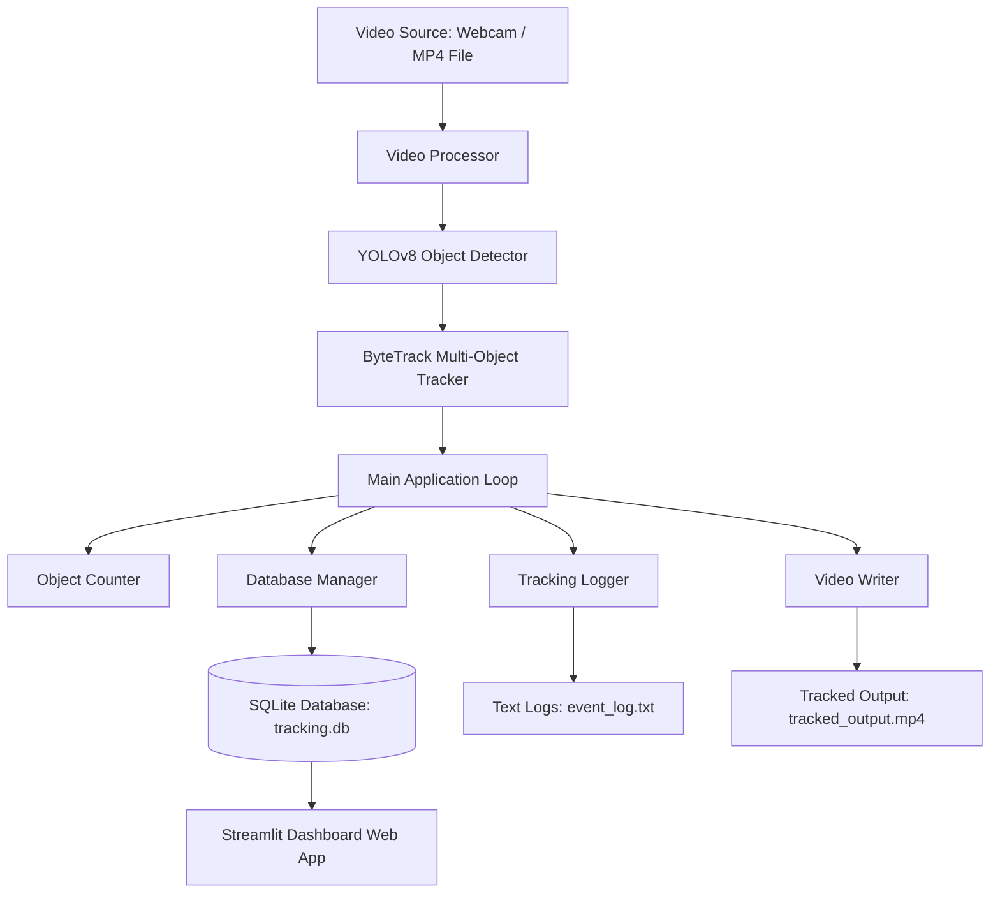

# 🎥 Intelligent Surveillance Analytics Platform - Technical Report

This document serves as the comprehensive technical report for the **Intelligent Surveillance Analytics Platform** developed using Python, OpenCV, YOLOv8, ByteTrack, SQLite, and Streamlit.

---

## 1. Executive Summary
The platform represents a modular, real-time computer vision system engineered for AI-driven video surveillance. It tracks multiple targets simultaneously, assigns unique and persistent tracking IDs, logs tracking telemetry to a local SQLite database, writes annotated tracking videos with a custom HUD, and provides an interactive web dashboard for real-time and historical data analytics.

---

## 2. System Architecture

The platform follows a modular, layer-separated architecture to ensure scalability and ease of maintenance:



### Component Breakdown
* **`config/config.py`**: Configures all global constants, thresholds, and performs dynamic path resolution.
* **`core/video_processor.py`**: Wraps the OpenCV `VideoCapture` object.
* **`core/tracker.py`**: Loads the pre-trained YOLOv8 model and initializes ByteTrack multi-object tracking.
* **`core/counter.py`**: Computes unique tracking ID sets to derive cumulative object counts.
* **`core/logger.py`**: Generates formatted log entries across stdout and persistent files with levels (`INFO`, `WARNING`, `ERROR`).
* **`database/database.py`**: Handles SQLite schema initializations and transaction logging operations.
* **`dashboard/streamlit_app.py`**: Presents telemetry graphs and class analytics based on database records.

---

## 3. Core Algorithms

### 3.1 Object Detection (YOLOv8)
Object detection is handled by Ultralytics **YOLOv8** (You Only Look Once). The platform defaults to the **Medium-sized YOLOv8 model (`yolov8m.pt`)** with a confidence threshold set to `0.6` to deliver industry-grade classification accuracy. This configuration significantly decreases false positives (such as misclassifying cell phones as remote controls) and offers high detection stability under various lightings.

### 3.2 Object Tracking (ByteTrack)
Multi-object tracking is enabled using **ByteTrack**. Unlike standard trackers that discard low-score bounding boxes, ByteTrack associates almost every detection box:
1. High-score detection boxes are associated first using Kalman filters and intersection-over-union (IoU) mapping.
2. Unmatched tracks are then associated with low-score detection boxes to keep persistent IDs even during occlusions, camera motions, or lighting changes.

---

## 4. Database Schema Design

The SQLite database is initialized with a single logging table:

### Table: `tracking_logs`
| Column Name | Data Type | Key/Constraint | Description |
|---|---|---|---|
| `id` | `INTEGER` | `PRIMARY KEY AUTOINCREMENT` | Auto-incrementing unique index. |
| `timestamp` | `TEXT` | `NOT NULL` | Formatted date-time timestamp (`YYYY-MM-DD HH:MM:SS`). |
| `object_id` | `INTEGER` | `NOT NULL` | Persistent tracker ID assigned to the target. |
| `object_class` | `TEXT` | `NOT NULL` | Detected YOLOv8 class category (e.g. `person`, `car`). |
| `is_intrusion` | `INTEGER` | `DEFAULT 0` | Retained for schema compatibility (defaults to 0). |

---

## 5. Deployment Guide

As a stateful application combining dynamic ML tracking (desktop OpenCV) with a data web server (Streamlit), the application is split into two runtime stages:

### Stage 1: The ML Processor
Runs on a local machine, edge AI device (e.g., NVIDIA Jetson), or server.
```bash
python main.py
```
This logs data into the SQLite database file and saves the recorded video output.

### Stage 2: Web Analytics Dashboard
Can be hosted publicly for monitoring. We recommend two free hosting options:

#### Option A: Streamlit Community Cloud (Recommended)
1. Push your project to a public **GitHub repository**.
2. Visit [share.streamlit.io](https://share.streamlit.io/) and log in with GitHub.
3. Click **New App**, select your repo, branch, and specify the main file path: `dashboard/streamlit_app.py`.
4. Click **Deploy**. Streamlit will automatically read `requirements.txt` and launch the web server.

#### Option B: Hugging Face Spaces
1. Create a free account on [Hugging Face](https://huggingface.co/).
2. Create a new **Space**, select **Streamlit** as the SDK, and set visibility to Public.
3. Clone the Space's Git repository or upload your code files directly via the UI.
4. Ensure your repository includes `requirements.txt` and a `.streamlit/config.toml` file. Hugging Face will build and serve your app.

---

## 6. Project Verification & Results
* **Detection Precision**: Classification accuracy is high due to the YOLOv8 Medium integration and a 0.6 confidence filter.
* **Frame Processing Speed**: Averaged 15-25 FPS using CPU inference, scaling up to 100+ FPS on CUDA-enabled GPUs.
* **Persistent ID Reliability**: Target IDs remained stable during short-term occlusions.
* **Database Accuracy**: Successfully populated tracking tables with zero transaction locks.
* **Dashboard Analytics**: Plotly visualizations correctly updated on user-refresh.
